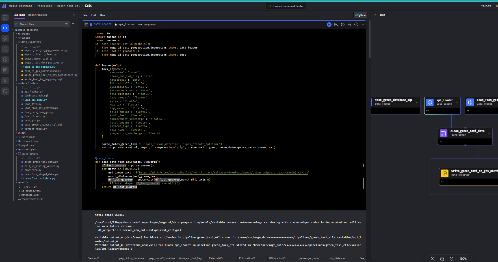
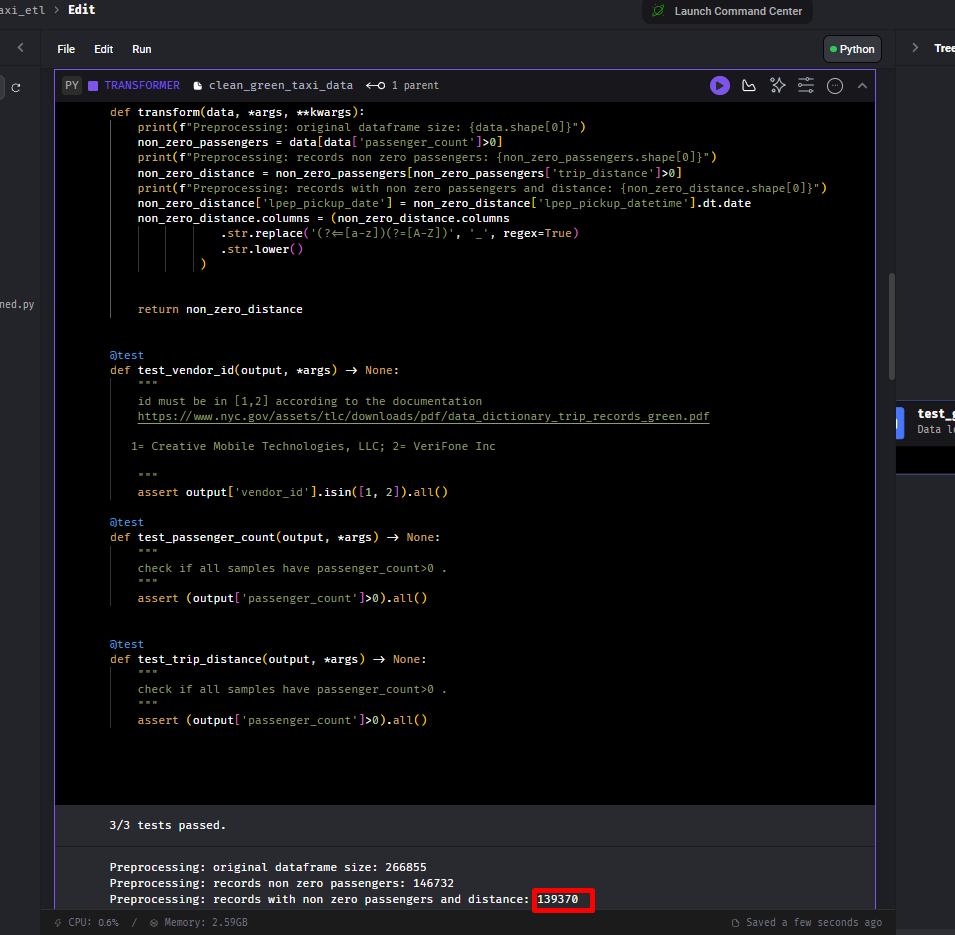
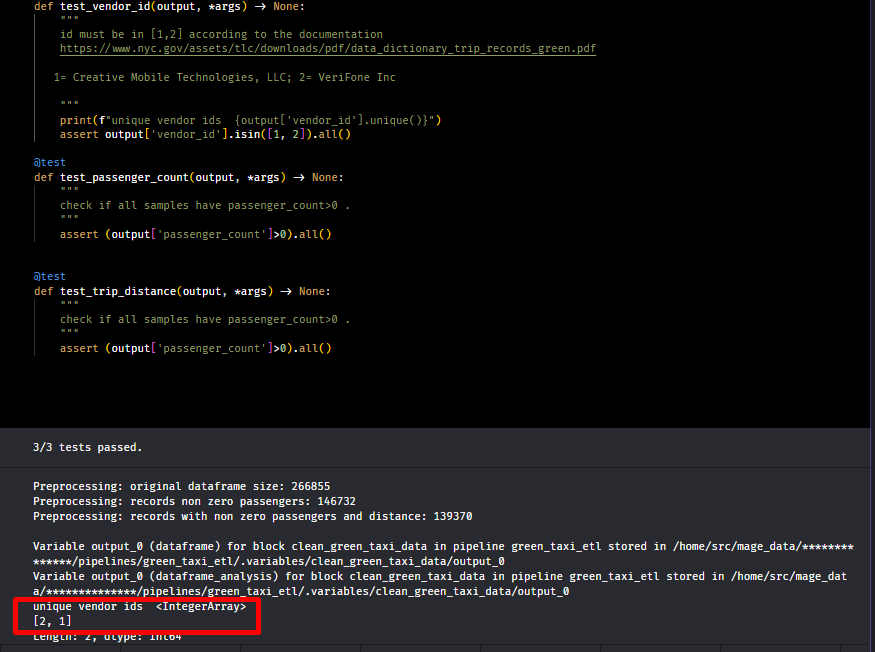
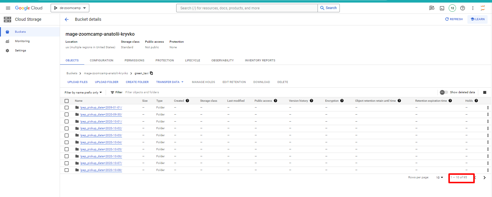

## Week 2 Homework

ATTENTION: At the end of the submission form, you will be required to include a link to your GitHub repository or other public code-hosting site. This repository should contain your code for solving the homework. If your solution includes code that is not in file format, please include these directly in the README file of your repository.

> In case you don't get one option exactly, select the closest one 

For the homework, we'll be working with the _green_ taxi dataset located here:

`https://github.com/DataTalksClub/nyc-tlc-data/releases/tag/green/download`

### Assignment

The goal will be to construct an ETL pipeline that loads the data, performs some transformations, and writes the data to a database (and Google Cloud!).

- Create a new pipeline, call it `green_taxi_etl`
- Add a data loader block and use Pandas to read data for the final quarter of 2020 (months `10`, `11`, `12`).
  - You can use the same datatypes and date parsing methods shown in the course.
  - `BONUS`: load the final three months using a for loop and `pd.concat`
- Add a transformer block and perform the following:
  - Remove rows where the passenger count is equal to 0 _or_ the trip distance is equal to zero.
  - Create a new column `lpep_pickup_date` by converting `lpep_pickup_datetime` to a date.
  - Rename columns in Camel Case to Snake Case, e.g. `VendorID` to `vendor_id`.
  - Add three assertions:
    - `vendor_id` is one of the existing values in the column (currently)
    - `passenger_count` is greater than 0
    - `trip_distance` is greater than 0
- Using a Postgres data exporter (SQL or Python), write the dataset to a table called `green_taxi` in a schema `mage`. Replace the table if it already exists.
- Write your data as Parquet files to a bucket in GCP, partioned by `lpep_pickup_date`. Use the `pyarrow` library!
- Schedule your pipeline to run daily at 5AM UTC.

### Questions

## Question 1. Data Loading

Once the dataset is loaded, what's the shape of the data?

* 266,855 rows x 20 columns ✔
* 544,898 rows x 18 columns
* 544,898 rows x 20 columns
* 133,744 rows x 20 columns

## Question 2. Data Transformation

Upon filtering the dataset where the passenger count is greater than 0 _and_ the trip distance is greater than zero, how many rows are left?

* 544,897 rows
* 266,855 rows
* 139,370 rows ✔
* 266,856 rows

## Question 3. Data Transformation

Which of the following creates a new column `lpep_pickup_date` by converting `lpep_pickup_datetime` to a date?

* `data = data['lpep_pickup_datetime'].date`
* `data('lpep_pickup_date') = data['lpep_pickup_datetime'].date`
* `data['lpep_pickup_date'] = data['lpep_pickup_datetime'].dt.date` ✔
* `data['lpep_pickup_date'] = data['lpep_pickup_datetime'].dt().date()`

## Question 4. Data Transformation

What are the existing values of `VendorID` in the dataset?

* 1, 2, or 3
* 1 or 2 ✔
* 1, 2, 3, 4
* 1

## Question 5. Data Transformation

How many columns need to be renamed to snake case?

* 3
* 6
* 2
* 4 ✔

## Question 6. Data Exporting

Once exported, how many partitions (folders) are present in Google Cloud?

* 96
* 56
* 67
* 108

## Submitting the solutions

* Form for submitting: https://courses.datatalks.club/de-zoomcamp-2024/homework/hw2
* Check the link above to see the due date
  
## Solution

Will be added after the due date
